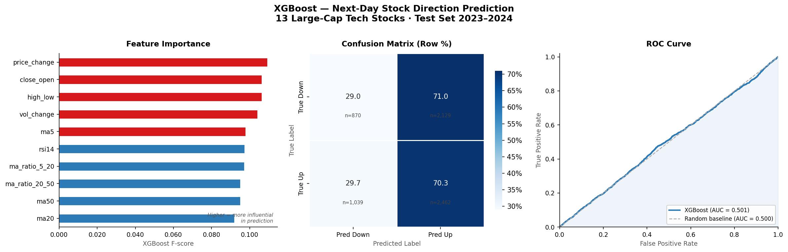

# Can Data Data Beat the Stock Market?

## Hook

Every day, trillions of dollars change hands in stock markets around the world. Behind every trade is a bet that a stock will go up or go down. What if a machine could learn to make that call better than chance?

## Problem Statement

Predicting stock prices has been a goal of mathematicians, economists, and data scientists for decades. Despite enormous advances in computing and machine learning, no one has reliably cracked it. The moment a reliable pattern is discovered, traders exploit it until it disappears. This project asks a narrower question, not whether we can predict exact prices, but whether we can predict direction of movement. Will a given tech stock close higher tomorrow than it does today? Using daily historical data for 13 major tech companies including Apple, Microsoft, and NVIDIA from 2015 through 2024, this project trains a machine learning model on technical indicators to answer that question.

## Solution Description

An XGBoost classifier was trained on ten features derived from each stock's historical price and volume data, including short and long-term moving averages, momentum signals, RSI, and daily changes in price and trading volume. The model learned from data spanning 2015–2022 and was tested on 2023–2024; the years it had never seen. The results are honest: the model does slightly better than a coin flip, landing at 51.3% accuracy. That might sound unimpressive, but the best professional traders rarely beat the market by more than a few percentage points annually. The result confirms that there is a faint signal in historical price patterns, but the market is efficient enough that it cannot be easily exploited by simple technical indicators alone.

## Chart

The three-panel figure shows feature importance (intraday price behavior matters most), a confusion matrix (the model is biased toward predicting upward movement, reflecting the historical upward drift of large-cap tech), and an ROC curve sitting just above the random baseline. Together they tell a story that the model learns something real, but markets are hard.